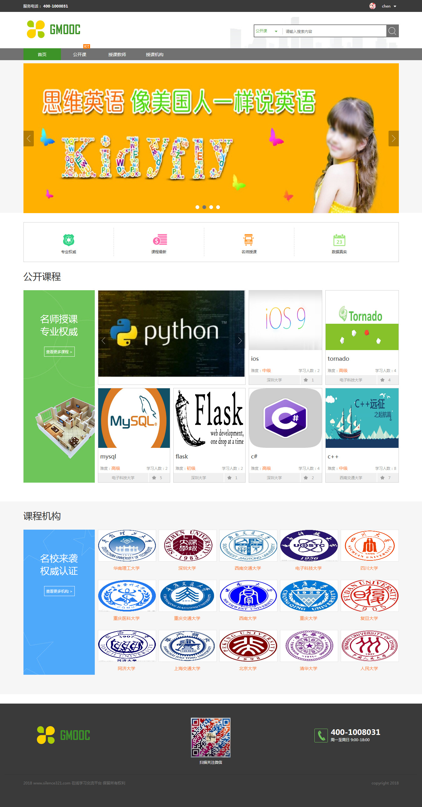

# django-educaton

#### nline education project
#### 项目地址: http://study.silence321.com/ 
#### 管理员后台地址: http://study.silence321.com/xadmin (账号:chen 密码:123456)

 

### 1、简介: 在线教育平台 dango+python2.7+mysql+xadmin
 

### 2、功能模块：
####  1,注册登录模块
#####  注册页:邮箱验证
#####  登录页:密码找回

 

####  2,主页模块
#####  首页: 分类搜索,轮播图,课程,机构展示

####  3,个人中心
#####  个人资料:编辑资料,修改头像,密码,邮箱
#####  我的课程:学习过的课程展示
#####  我的收藏:收藏的课程,教师,机构展示与删除
#####  我的消息:消息展示

####  4,课程模块
#####  课程列表页:课程分页,排序,热门课程推荐
#####  课程详情页:课程收藏,开始学习,相关课程推荐
#####  课程播放:课程章节,课程评论,资源下载,讲师提示,该课同学还学过推荐

####  4,讲师模块
#####  讲师列表页:讲师分页,排序,讲师排行榜
#####  讲师详情页:讲师收藏,讲师全部课程

####  5,机构模块
#####  机构列表页:机构分页,筛选,排序,机构咨询,排名
#####  机构详情页:机构首页,机构课程,机构介绍,机构讲师,机构收藏

####  6,xadmin后台管理系统

### 3、项目目录结构：

    +--apps
    |      +--courses  #课程
    |      |      +--admin.py
    |      |      +--adminx.py
    |      |      +--apps.py
    |      |      +--migrations
    |      |      +--models.py
    |      |      +--tests.py
    |      |      +--urls.py
    |      |      +--views.py
    |      |      +--__init__.py
    |      +--operation  #操作
    |      |      +--admin.py
    |      |      +--adminx.py
    |      |      +--apps.py
    |      |      +--migrations
    |      |      +--models.py
    |      |      +--tests.py
    |      |      +--views.py
    |      |      +--__init__.py
    |      +--organization  #学校
    |      |      +--admin.py
    |      |      +--adminx.py
    |      |      +--apps.py
    |      |      +--forms.py
    |      |      +--migrations
    |      |      +--models.py
    |      |      +--tests.py
    |      |      +--urls.py
    |      |      +--views.py
    |      |      +--__init__.py
    |      +--users  #用户
    |      |      +--admin.py
    |      |      +--adminx.py
    |      |      +--apps.py
    |      |      +--forms.py
    |      |      +--migrations
    |      |      +--models.py
    |      |      +--tests.py
    |      |      +--urls.py
    |      |      +--views.py
    |      |      +--__init__.py
    |      +--utils
    |      |      +--email_send.py
    |      |      +--mixin_utils.py
    |      |      +--__init__.py
    |      +--__init__.py
    +--extra_apps  
    |      +--xadmin  #  后台管理系统
    |      +--__init__.py
    +--media
    |      +--banner
    |      +--course
    |      +--courses
    |      +--image
    |      +--org
    |      +--teacher
    +--static
    |      +--css
    |      +--images
    |      +--js
    |      +--xadmin
    +--study
    |      +--settings.py
    |      +--urls.py
    |      +--wsgi.py
    |      +--__init__.py
    +--templates ##  模板
    +--manage.py 
